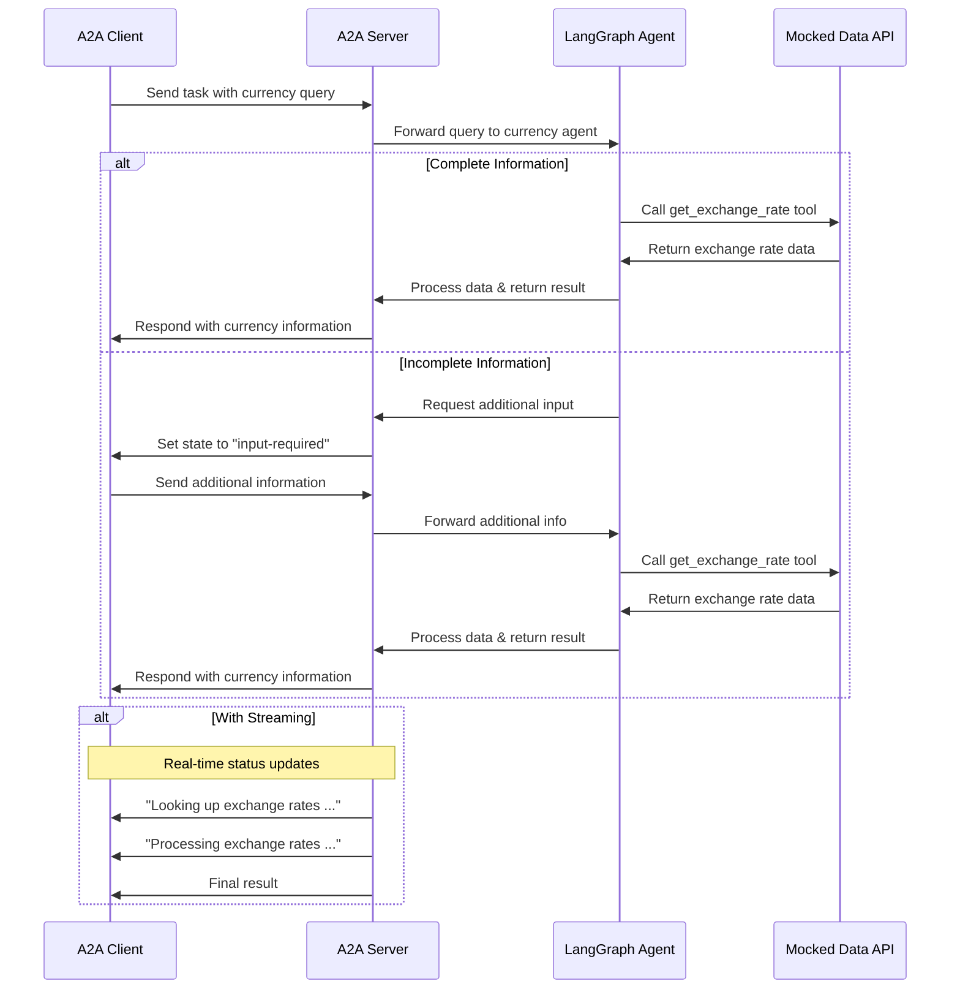

# A2A LangGraph/LangChain Agent using IBM watsonx.ai

This repo contains an example agent which converts currencies via a tool. The agent has been implemented with LangGraph/LangChain. It uses a Granite model running on IBM watsonx.ai. The agent can be run standalone, and it also exposes an A2A interface. Via A2A the agent can be integrated in IBM watsonx Orchestrate.

The following technologies are demonstrated:

* [Agent2Agent](https://a2a-protocol.org/) (A2A)
* [LangGraph](https://www.langchain.com/langgraph)
* [LangChain](https://www.langchain.com/)
* [Granite](https://huggingface.co/ibm-granite) models
* [IBM watsonx.ai](https://www.ibm.com/docs/en/watsonx/saas?topic=overview-watsonx)
* [IBM watsonx.ai in LangChain](https://docs.langchain.com/oss/python/integrations/chat/ibm_watsonx)
* [A2A in IBM watsonx Orchestrate](https://developer.watson-orchestrate.ibm.com/agents/connect_agent#agent-to-agent-a2a-protocol)

## Scenario

The example is an extension of [a2aproject/a2a-samples/samples/python/agents/langgraph](https://github.com/a2aproject/a2a-samples/tree/main/samples/python/agents/langgraph). Users can ask questions like 'how much is 1 USD in EUR?' 

A2A supports multiple potential flows:
1. Synchronous single-turn conversation with question and answer
2. Single-turn conversation with streaming
3. Multi-turn conversation when more user input is required, for example the currency to convert to

**Flow 1: Synchronous**

Conversation:
* User: How much is 1 USD in EUR?
* Agent: Looking up the exchange rates ...
* Agent: Processing the exchange rates ...
* Agent: Based on the latest exchange rate, 1 USD is equivalent to 0.9 EUR.

Request:

```
POST http://localhost:10000
Content-Type: application/json

{
    "id": "12113c25-b752-473f-977e-c9ad33cf4f56",
    "jsonrpc": "2.0",
    "method": "message/send",
    "params": {
        "message": {
            "kind": "message",
            "messageId": "120ec73f93024993becf954d03a672bc",
            "parts": [
                {
                    "kind": "text",
                    "text": "how much is 1 USD in EUR?"
                }
            ],
            "role": "user"
        }
    }
}
```

Response:

```
{
  "id": "12113c25-b752-473f-977e-c9ad33cf4f56",
  "jsonrpc": "2.0",
  "result": {
    "artifacts": [
      {
        "artifactId": "a31f14d4-58dc-4e7a-8225-b75c028b95c3",
        "name": "conversion_result",
        "parts": [
          {
            "kind": "text",
            "text": " Based on the latest exchange rate, 1 USD is equivalent to 0.9 EUR."
          }
        ]
      }
    ],
    "contextId": "3219a27c-f1e6-4087-ad87-cf9b5985a9de",
    "history": [
      {
        "contextId": "3219a27c-f1e6-4087-ad87-cf9b5985a9de",
        "kind": "message",
        "messageId": "120ec73f93024993becf954d03a672bc",
        "parts": [
          {
            "kind": "text",
            "text": "how much is 1 USD in EUR?"
          }
        ],
        "role": "user",
        "taskId": "d94c8e9e-f2b0-4512-90e7-a7714be3e624"
      },
      {
        "contextId": "3219a27c-f1e6-4087-ad87-cf9b5985a9de",
        "kind": "message",
        "messageId": "3363734c-217f-48e9-9154-c63679707be4",
        "parts": [
          {
            "kind": "text",
            "text": "Looking up the exchange rates ..."
          }
        ],
        "role": "agent",
        "taskId": "d94c8e9e-f2b0-4512-90e7-a7714be3e624"
      },
      {
        "contextId": "3219a27c-f1e6-4087-ad87-cf9b5985a9de",
        "kind": "message",
        "messageId": "41ace0d5-ffe9-4710-82d3-f25cdd5f8b57",
        "parts": [
          {
            "kind": "text",
            "text": "Processing the exchange rates ..."
          }
        ],
        "role": "agent",
        "taskId": "d94c8e9e-f2b0-4512-90e7-a7714be3e624"
      }
    ],
    "id": "d94c8e9e-f2b0-4512-90e7-a7714be3e624",
    "kind": "task",
    "status": {
      "state": "completed",
      "timestamp": "2025-11-24T08:50:59.270564+00:00"
    }
  }
}
```

**Flow 2: Streaming**

Conversation:
* User: How much is 1 USD in EUR?
* Agent: Looking up the exchange rates ...
* Agent: Processing the exchange rates ...
* Agent: Based on the latest exchange rate, 1 USD is equivalent to 0.9 EUR.

Request:

```
POST http://localhost:10000

{
    "id": "6d12d159-ec67-46e6-8d43-18480ce7f6ca",
    "jsonrpc": "2.0",
    "method": "message/stream",
    "params": {
        "message": {
            "kind": "message",
            "messageId": "2f9538ef0984471aa0d5179ce3c67a28",
            "parts": [
                {
                    "kind": "text",
                    "text": "how much is 1 USD in EUR?"
                }
            ],
            "role": "user"
        }
    }
}
```

Response:

```
data: {"id":"6d12d159-ec67-46e6-8d43-18480ce7f6ca","jsonrpc":"2.0","result":{"contextId":"5ae9c7e9-6973-406f-806c-0fc6b4ea31e2","history":[{"contextId":"5ae9c7e9-6973-406f-806c-0fc6b4ea31e2","kind":"message","messageId":"2f9538ef0984471aa0d5179ce3c67a28","parts":[{"kind":"text","text":"how much is 1 USD in EUR?"}],"role":"user","taskId":"b812fa9c-ccf1-4abd-aaeb-06f75db7f8f8"}],"id":"b812fa9c-ccf1-4abd-aaeb-06f75db7f8f8","kind":"task","status":{"state":"submitted"}}}

: ping - 2025-11-24 08:51:19.704125+00:00

data: {"id":"6d12d159-ec67-46e6-8d43-18480ce7f6ca","jsonrpc":"2.0","result":{"contextId":"5ae9c7e9-6973-406f-806c-0fc6b4ea31e2","final":false,"kind":"status-update","status":{"message":{"contextId":"5ae9c7e9-6973-406f-806c-0fc6b4ea31e2","kind":"message","messageId":"28684e1a-ede0-454e-8f97-37df8112eefa","parts":[{"kind":"text","text":"Looking up the exchange rates ..."}],"role":"agent","taskId":"b812fa9c-ccf1-4abd-aaeb-06f75db7f8f8"},"state":"working","timestamp":"2025-11-24T08:51:25.203342+00:00"},"taskId":"b812fa9c-ccf1-4abd-aaeb-06f75db7f8f8"}}

data: {"id":"6d12d159-ec67-46e6-8d43-18480ce7f6ca","jsonrpc":"2.0","result":{"contextId":"5ae9c7e9-6973-406f-806c-0fc6b4ea31e2","final":false,"kind":"status-update","status":{"message":{"contextId":"5ae9c7e9-6973-406f-806c-0fc6b4ea31e2","kind":"message","messageId":"057a773f-af95-439f-806d-605d40e1a87e","parts":[{"kind":"text","text":"Processing the exchange rates ..."}],"role":"agent","taskId":"b812fa9c-ccf1-4abd-aaeb-06f75db7f8f8"},"state":"working","timestamp":"2025-11-24T08:51:25.206263+00:00"},"taskId":"b812fa9c-ccf1-4abd-aaeb-06f75db7f8f8"}}

data: {"id":"6d12d159-ec67-46e6-8d43-18480ce7f6ca","jsonrpc":"2.0","result":{"artifact":{"artifactId":"67c07e6a-b026-4786-b5ba-10584c8c6d55","name":"conversion_result","parts":[{"kind":"text","text":" Based on the latest exchange rate, 1 USD is equivalent to 0.9 EUR."}]},"contextId":"5ae9c7e9-6973-406f-806c-0fc6b4ea31e2","kind":"artifact-update","taskId":"b812fa9c-ccf1-4abd-aaeb-06f75db7f8f8"}}

data: {"id":"6d12d159-ec67-46e6-8d43-18480ce7f6ca","jsonrpc":"2.0","result":{"contextId":"5ae9c7e9-6973-406f-806c-0fc6b4ea31e2","final":true,"kind":"status-update","status":{"state":"completed","timestamp":"2025-11-24T08:51:25.899051+00:00"},"taskId":"b812fa9c-ccf1-4abd-aaeb-06f75db7f8f8"}}
```

**Flow 3: Multi-turn**

Conversation:
* User: How much is the exchange rate for 1 USD?
* Agent: I'm sorry, but to provide the exchange rate, I need to know which currency you'd like to convert 1 USD to. Could you please specify the target currency? For example, are you interested in USD to EUR, USD to GBP, or another currency?
* User: EUR
* Agent: Looking up the exchange rates ...
* Agent: Processing the exchange rates ...
* Agent: Based on the latest exchange rate data, 1 USD is equivalent to approximately 0.90 EUR.

Request - Seq 1:

```
POST http://localhost:10000
Content-Type: application/json

{
    "id": "27be771b-708f-43b8-8366-968966d07ec0",
    "jsonrpc": "2.0",
    "method": "message/send",
    "params": {
        "message": {
            "kind": "message",
            "messageId": "296eafc9233142bd98279e4055165f12",
            "parts": [
                {
                    "kind": "text",
                    "text": "How much is the exchange rate for 1 USD?"
                }
            ],
            "role": "user"
        }
    }
}
```

Response - Seq 2:

```
{
  "id": "27be771b-708f-43b8-8366-968966d07ec0",
  "jsonrpc": "2.0",
  "result": {
    "contextId": "694877cc-c7cc-4a20-af6c-f982636d29cc",
    "history": [
      {
        "contextId": "694877cc-c7cc-4a20-af6c-f982636d29cc",
        "kind": "message",
        "messageId": "296eafc9233142bd98279e4055165f12",
        "parts": [
          {
            "kind": "text",
            "text": "How much is the exchange rate for 1 USD?"
          }
        ],
        "role": "user",
        "taskId": "ff19a722-c018-4653-be00-fda092f18f65"
      }
    ],
    "id": "ff19a722-c018-4653-be00-fda092f18f65",
    "kind": "task",
    "status": {
      "message": {
        "contextId": "694877cc-c7cc-4a20-af6c-f982636d29cc",
        "kind": "message",
        "messageId": "a1d1722f-9648-4f6a-b5fc-26e587387c29",
        "parts": [
          {
            "kind": "text",
            "text": " I'm sorry, but to provide the exchange rate, I need to know which currency you'd like to convert 1 USD to. Could you please specify the target currency? For example, are you interested in USD to EUR, USD to GBP, or another currency?"
          }
        ],
        "role": "agent",
        "taskId": "ff19a722-c018-4653-be00-fda092f18f65"
      },
      "state": "input-required",
      "timestamp": "2025-11-24T08:52:34.523003+00:00"
    }
  }
}
```

Request - Seq 3:

```
POST http://localhost:10000
Content-Type: application/json

{
    "id": "b88d818d-1192-42be-b4eb-3ee6b96a7e35",
    "jsonrpc": "2.0",
    "method": "message/send",
    "params": {
        "message": {
            "contextId": "694877cc-c7cc-4a20-af6c-f982636d29cc",
            "kind": "message",
            "messageId": "70371e1f231f4597b65ccdf534930ca9",
            "parts": [
                {
                    "kind": "text",
                    "text": "EUR"
                }
            ],
            "role": "user",
            "taskId": "ff19a722-c018-4653-be00-fda092f18f65"
        }
    }
}
```

Response - Seq 4:

```
{
  "id": "b88d818d-1192-42be-b4eb-3ee6b96a7e35",
  "jsonrpc": "2.0",
  "result": {
    "artifacts": [
      {
        "artifactId": "ab595c17-525c-4579-94d6-d96f91dfd177",
        "name": "conversion_result",
        "parts": [
          {
            "kind": "text",
            "text": " Based on the latest exchange rate data, 1 USD is equivalent to approximately 0.90 EUR."
          }
        ]
      }
    ],
    "contextId": "694877cc-c7cc-4a20-af6c-f982636d29cc",
    "history": [
      {
        "contextId": "694877cc-c7cc-4a20-af6c-f982636d29cc",
        "kind": "message",
        "messageId": "296eafc9233142bd98279e4055165f12",
        "parts": [
          {
            "kind": "text",
            "text": "How much is the exchange rate for 1 USD?"
          }
        ],
        "role": "user",
        "taskId": "ff19a722-c018-4653-be00-fda092f18f65"
      },
      {
        "contextId": "694877cc-c7cc-4a20-af6c-f982636d29cc",
        "kind": "message",
        "messageId": "a1d1722f-9648-4f6a-b5fc-26e587387c29",
        "parts": [
          {
            "kind": "text",
            "text": " I'm sorry, but to provide the exchange rate, I need to know which currency you'd like to convert 1 USD to. Could you please specify the target currency? For example, are you interested in USD to EUR, USD to GBP, or another currency?"
          }
        ],
        "role": "agent",
        "taskId": "ff19a722-c018-4653-be00-fda092f18f65"
      },
      {
        "contextId": "694877cc-c7cc-4a20-af6c-f982636d29cc",
        "kind": "message",
        "messageId": "70371e1f231f4597b65ccdf534930ca9",
        "parts": [
          {
            "kind": "text",
            "text": "EUR"
          }
        ],
        "role": "user",
        "taskId": "ff19a722-c018-4653-be00-fda092f18f65"
      },
      {
        "contextId": "694877cc-c7cc-4a20-af6c-f982636d29cc",
        "kind": "message",
        "messageId": "1792e230-e6c9-46bf-8e2d-07b15b071eee",
        "parts": [
          {
            "kind": "text",
            "text": "Looking up the exchange rates ..."
          }
        ],
        "role": "agent",
        "taskId": "ff19a722-c018-4653-be00-fda092f18f65"
      },
      {
        "contextId": "694877cc-c7cc-4a20-af6c-f982636d29cc",
        "kind": "message",
        "messageId": "9463fd42-cdd6-45b7-b2d8-124a0f2efe6b",
        "parts": [
          {
            "kind": "text",
            "text": "Processing the exchange rates ..."
          }
        ],
        "role": "agent",
        "taskId": "ff19a722-c018-4653-be00-fda092f18f65"
      }
    ],
    "id": "ff19a722-c018-4653-be00-fda092f18f65",
    "kind": "task",
    "status": {
      "state": "completed",
      "timestamp": "2025-11-24T08:53:36.638172+00:00"
    }
  }
}
```

**Flow Diagram**



## Setup

Prerequisites:

* [Python](https://www.python.org/downloads/) 3.13 or higher
* [uv](https://docs.astral.sh/uv/#installation)
* [IBM watsonx.ai](https://eu-de.dataplatform.cloud.ibm.com/registration/stepone?context=wx&preselect_region=true)

Create an environment file with your watsonx.ai credentials:

```
git clone https://github.com/nheidloff/ibm-watsonx-ai-langgraph-langchain-a2a
cd ibm-watsonx-ai-langgraph-langchain-a2a
cp .env.example .env
```

Define [WATSONX_API_KEY](https://cloud.ibm.com/docs/account?topic=account-userapikey&interface=ui) and WATSONX_PROJECT_ID in .env.

First terminal:

```
uv run app
```

Second terminal:

```
python tests/watsonx_client.py
python tests/a2a_client.py
```

Import in Orchestrate:

```
cd to-folder-with-orchestrate-env-file
orchestrate server start --env-file=./.env -l
orchestrate chat start

orchestrate agents import -f path-to-this-repo/orchestrate/orchestrate_agent.yaml
orchestrate agents remove -n currency_agent -k external
```